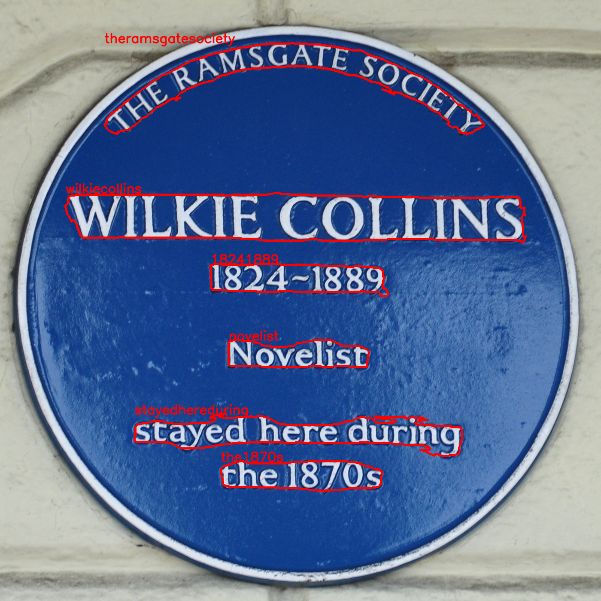

# OCR



OCR pipeline detects and recognizes text in images. OCR was written in 
PyTorch and allows use ONNX inference and OpenVINO optimization. 
Detailed info about the neural networks used can be found here:
[recognition model](https://github.com/KonstantinDob/ocr_recognition), 
[detection model](https://github.com/KonstantinDob/ocr_detection).

## Installation

Requirements:
* numpy==1.19.5
* opencv-python==4.5.5.62
* PyYAML==6.0
* torch==1.10.2
* onnx==1.12.0
* onnxruntime==1.11.1
* openvino==2022.1.0
* git+https://github.com/KonstantinDob/ocr_detection
* git+https://github.com/KonstantinDob/ocr_recognition

From pip:
```
python -m build
pip install dist/ocr-1.0.0-py3-none-any.whl
```

From source:
```
pip install -U git+https://github.com/KonstantinDob/ocr
```

## Run Inference
To run Inference you should prepare weights and configs. After
`python3 bin/inference.py --datapath=YOUR_PATH_TO_DATA`
If you want to use ONNX inference or OpenVINO optimization you should
use scripts from ocr/modules.

## Docker 

To use docker with GPU you need *nvidia-docker == 2.9.0*.

Build project:

```
make build
```

Run in interactive mode:

```
make run
```
